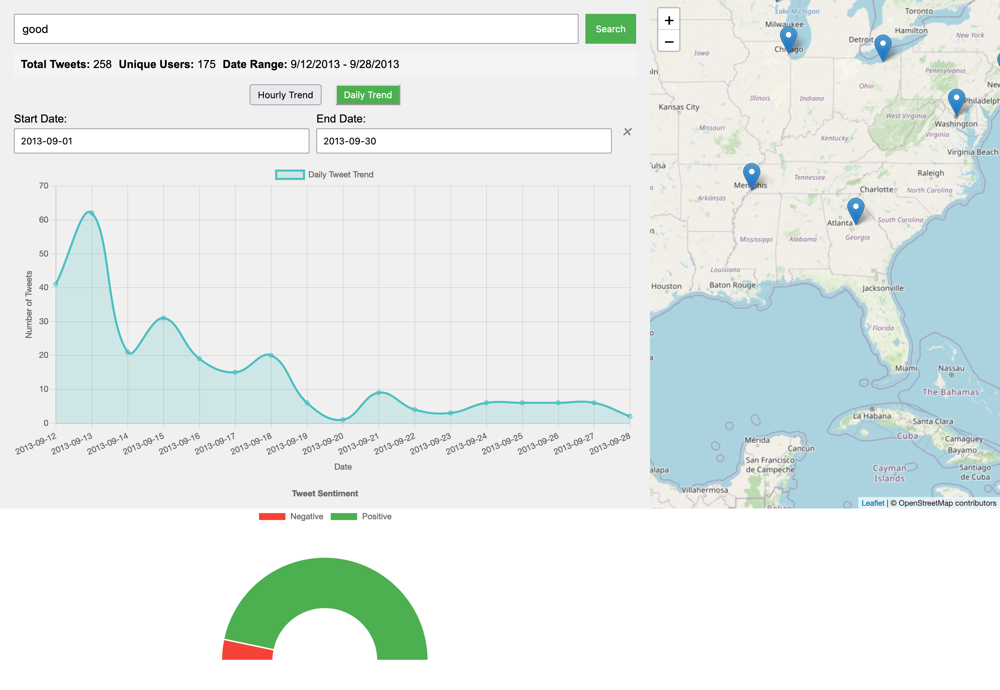

#  Twitter Stream Processing Pipeline

## Project Overview

A complete data pipeline for processing, transforming, and making stream of tweets data searchable across text, time, and space using Scala, Python, Apache Kafka, Spark, Spark NLP, and MongoDB with a web application that provides the capability to search for key words to display the geographical distribution, trending topics, and tweets sentiment in real-time using HTML, and JavaScript. 



## Architecture

### Components
- **Data Ingestion**: Python Kafka Producer
- **Stream Processing**: Scala Spark Streaming with Spark NLP
- **Message Broker**: Apache Kafka
- **Persistent Storage**: MongoDB
- **Search Capabilities**: Advanced searching for text, time, and geospatial
- **Dashboard**: Web application for visualization 


### Key Features
- Large json as source for tweets data
- Real-time stream processing
- Advanced text searchability
- Tweet metadata extraction
- Geospatial and temporal indexing
- Sentiment analysis

## Advanced Search Capabilities

- **Advanced Search**
  - Search using multi fields (text, username, hashtags)
  - Instant result filtering
  - Display search statistics

- **Interactive Geospatial Visualization**
  - Map-based tweet location tracking
  - Clickable markers with tweet details
  - Zoom and pan capabilities

- **Sentiment Analysis**
  - Real-time sentiment gauge
  - Positive/Negative tweet percentage

- **Trend Visualization**
  - Hourly and daily tweet trends
  - Dynamic trend switching

## Technology Stack

### Data collection, processing, and storage
- **Ingestion**: Python
- **Stream Processing**: Scala, Apache Spark, Spark NLP, Bloom Filter
- **Messaging**: Apache Kafka
- **Database**: MongoDB

### Web app Backend
- **Language**: Python
- **Framework**: Flask
- **Database**: MongoDB
- **Data Processing**: PyMongo

### Web app Frontend
- **Technologies**: HTML, JavaScript
- **Libraries**: Chart.js, Leaflet.js

## Prerequisites

- Python 3.8+
- Scala 2.12.x
- Java 11+
- Apache Kafka 2.12
- Apache Spark 3.5.3
- MongoDB 8.0+
- Spark NLP 5.5.1
- Mongo Spark Connector 10.4.0

## Installation

1. Clone the repository
```bash
git clone https://github.com/yourusername/advanced-tweet-search-pipeline.git
cd TwitterStreamProcessingPipeline
```

2. Install Python dependencies
```bash 
pip install -r requirements.txt
```

Set up environment variables Create a .env file in the root project directory:
```Code
JSON_FILE_PATH=boulder_flood_geolocated_tweets.json
```

3. Install Scala dependencies

4. Configuration for Web Application
Set up environment variables Create a .env file in the WebApplication directory:
```Code
MONGO_URI=mongodb://localhost:27017/
MONGO_DATABASE=tweets_db
MONGO_COLLECTION=tweets
```

## Running the Application
1. Start Kafka and ZooKeeper
```bash
kafka-server-start.sh config/server.properties
zookeeper-server-start.sh config/zookeeper.properties
```

2. Start MongoDB
```bash
mongod
```

3. Run Python Kafka Producer
```bash
python KafkaJsonProducer.py
```

4. Run Scala Spark Processor Project

5. Run the Web application
```bash
cd WebApplication
# Development Mode
python WebApp.py
```
Usage
- Open http://127.0.0.1:5000 in the browser
- Use the search bar to search for key words
- Explore tweet locations on the interactive map
- Select time interval to check trends during period of time
- Switch between hourly and daily trends
- Check the sentiment percentages in the gauge
